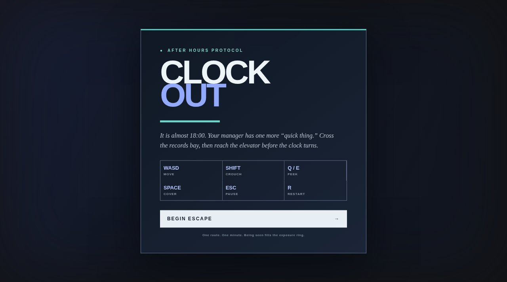

# Clock Out

It is almost 18:00. Your manager has one more quick thing. Leave on time.



**Live:** https://aeiouvcode.github.io/clock-out/

## About

A short stealth game set in an office after hours. Cross the records bay and reach the elevator before the clock turns without being seen. Being spotted fills the exposure ring; getting caught by the supervisor rolls your clock back with a new task.

## Controls

| Key | Action |
| --- | --- |
| WASD | Move |
| Shift | Crouch |
| Q / E | Peek |
| Space | Cover |
| Esc | Pause |
| R | Restart |

## Built with

Three.js (vendored in `vendor/`), plain JavaScript and CSS. No build step and no CDN, so it runs fully offline.

## Run locally

```sh
git clone https://github.com/aeiouvcode/clock-out.git
cd clock-out
python3 -m http.server 8000
```

Then open http://localhost:8000.

## Layout

```
index.html               page shell
game.js                  game logic and rendering
style.css                HUD and menus
vendor/three.module.js   Three.js
docs/                    README assets
```
